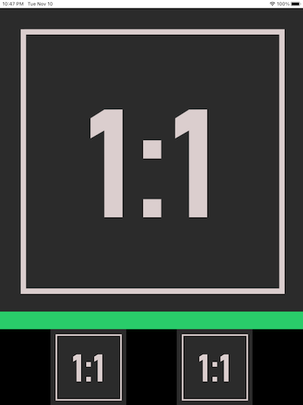
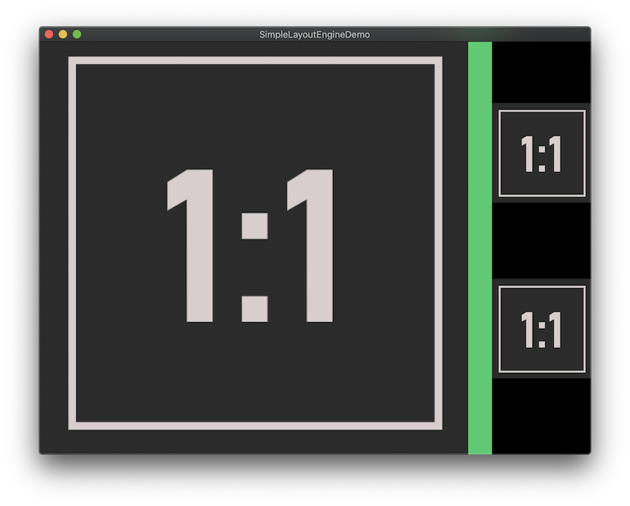
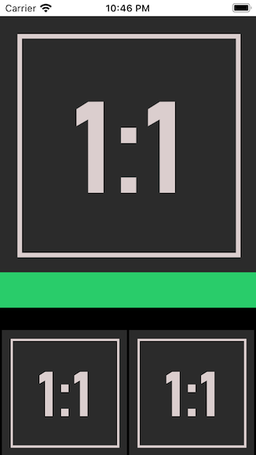
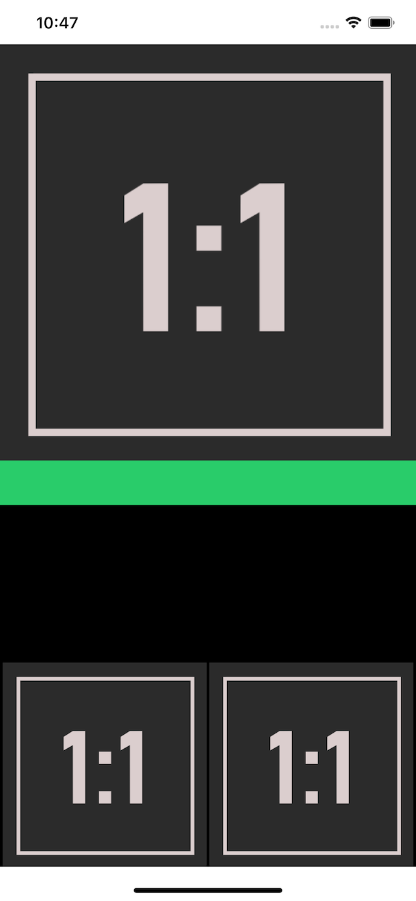

# SimpleLayoutEngine

A simplistic layout engine

Read this: [Introducing Simple Layout Engine](https://medium.com/@chunkyguy/introducing-simple-layout-engine-7106a4981202)

### Objective-C version

There's also an Objective-C version which isn't updated as frequently

https://github.com/chunkyguy/SimpleLayoutEngine-objc
Read this: [whackylabs.com/objc/ui/2020/09/15/simple-manual-layout/](https://whackylabs.com/objc/ui/2020/09/15/simple-manual-layout/)

### Screenshots

**iPad Pro**

**Mac**

**iPod Touch**

**iPhone 11 Pro Max**

